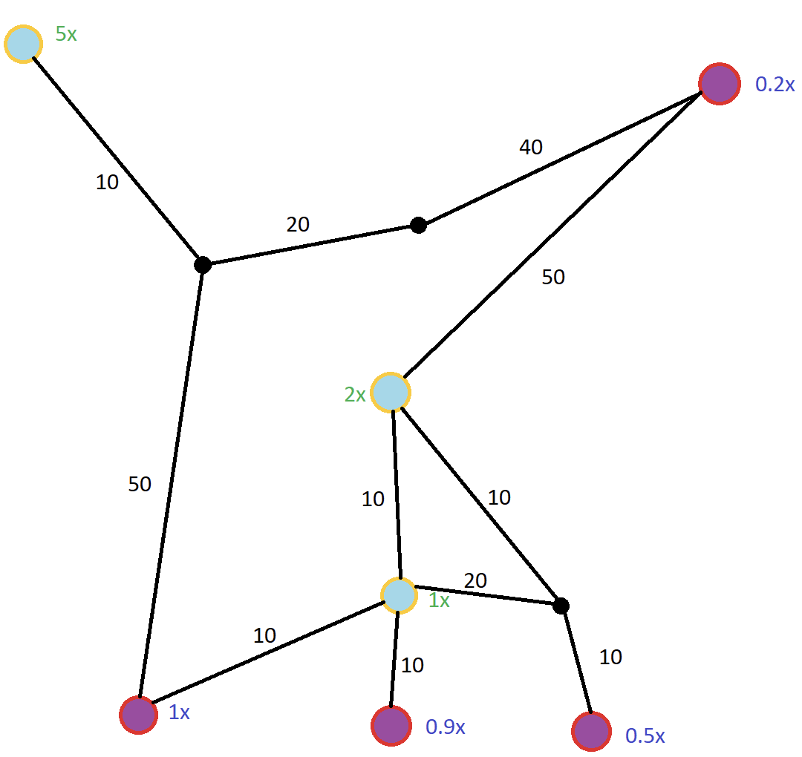

**Тестовое задание для Unity-разработчика**

**Цель задания**

Создать интерактивную сцену в Unity, моделирующую добычу ресурсов поездами на графе. Задание направлено на проверку навыков работы с алгоритмами, структур данных и принципами ООП.

**Описание задачи**

1. **Основные элементы:**

    - **Базы**:

        - Располагаются в вершинах графа.

        - Каждая база имеет множитель ресурсов, на который умножается количество привезённого ресурса. (этот параметр можно в Realtime менять в инспекторе). Т.е. по прибытии поезда на базу 2х по итогу в Total будет +2 ресурса.

        - На рисунке обозначены голубым с желтой каймой

    - **Шахты**:

        - Также располагаются в вершинах графа.

        - Каждая шахта имеет множитель времени добычи ресурса, на который умножается базовое время добычи ресурса поезда. (этот параметр можно в Realtime менять в инспекторе). Т.е. по прибытии поезда с базовым времени добычи 20 секунд на шахту 0.2х – он зарержится на шахте 4 секунды.

        - На рисунке обозначены фиолетовым с красной каймой

    - **Поезда**:

        - Передвигаются по рёбрам графа между базами и шахтами.

        - Каждый поезд имеет:

            - Скорость передвижения.

            - Скорость добычи ресурса

        - Задача поезда — максимально эффективно добывать ресурсы из шахт и доставлять их на базы.

        - Поезд всегда добывает и везёт одну единицу ресурса, которая впоследствии умножается на коэффициент базы по прибытии.

        - Все поезда спавнятся рандомно

2. **Граф:**

- Базы и шахты соединены путями, образуя связный граф.

- Длина каждого пути фиксирована и задаётся в инспекторе

- Каждая вершина графа имеет ссылки на соседние вершины, с которыми она соединена.

3. **Визуализация:**

- Должно быть видно:

    - Передвижение поездов в реальном времени.

    - Подсвеченные пути поездов (можно реализовать через Gizmos в SceneView).

- Графика не важна, поезда могут быть капсулами, базы, ноды и шахты – кубиками/сферами или вашей любимой геометрической фигурой

- Должен быть виден Total по ресурсам, который изменяется каждый раз по прибытии поезда на базу.

4. Изменяемые параметры:

- Множитель ресурса базы при привозе (Realtime/PlayMode)

- Множитель скорости добычи ресурса шахты (Realtime/PlayMode)

- Скорость передвижения и скорость добычи поездов (Realtime/PlayMode)

- Длины рёбер графов

Параметры поездов:\
&#x20;Поезд 1:

- Скорость передвижения: 200

- Базовая скорость добычи: 20s

Поезд 2:

- Скорость передвижения: 5

- Базовая скорость добычи: 1s

Поезд 3:

- На ваше усмотрение 😊

